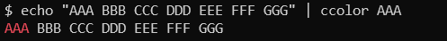
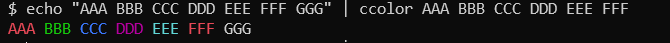
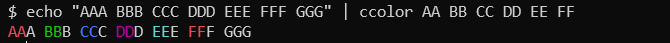
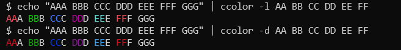
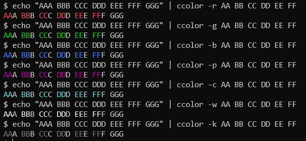
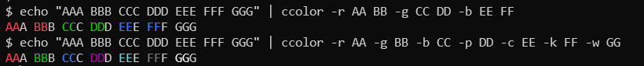
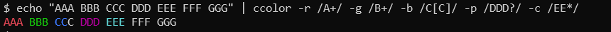

# ccolor commond

# Overview

A simple command that highlights specific words with color in Bash.
When reviewing large volumes of log files, it's easy to miss important information, so this tool colorizes specific text to make it stand out.
Built with Bash and AWK, it should be extremely safe,
though I have not fully reviewed every aspect of AWK's behavior.
This command was created with Claude Code (Opus 4.6).

Bashで特定の単語に色を付けるだけのコマンドです。色ハイライト。

例えば、ログファイルを大量に見る際、重要な文字を見逃すことも多いので、
特定の文字に色をつけて、わかりやすくします。

bashとawkで作られており、安全性が極めて高いと思いますが、
awkの動作をすべて理解してレビューしているわけではありません。

このコマンドはClaude Code (Ops 4.6)で作成しました。


# Install インストール

## RPM Install
```
yum install https://github.com/tryandhappy/ccolor/releases/latest/download/ccolor.noarch.rpm
```
```
dnf install https://github.com/tryandhappy/ccolor/releases/latest/download/ccolor.noarch.rpm
```


## Debian/Ubuntu Install
```
wget https://github.com/tryandhappy/ccolor/releases/latest/download/ccolor_all.deb
apt install ./ccolor_0.1.2-1_all.deb
```


## General Linux
```
wget -O /usr/bin/ccolor https://github.com/tryandhappy/ccolor/releases/latest/download/ccolor
```


# Usage 使い方


引数省略したときは、ログを見るときに便利な、主要な注意すべき文字をハイライトします。

```
cat /var/log/messages | ccolor
tail -f /var/log/syslog | ccolor
```


## Default value when the argument in not specified

This is a command in Bash that simply colors specific words.

引数を省略した場合は、下記ｎのオプションと同じになります。
この内容は随時変更していきます。
```
ccolor \
  -r Fatal Critical Alert Alart Exception Crash Abort Failed Panic Corrupt Overflow Underflow Invalid \
  -m Caution Deprecated Timeout Denied Refused Unauthorized Forbidden Unavailable Disconnect Reset Unexpected Broken
```


## Simple Sample

```
$ echo "AAA BBB CCC DDD EEE FFF GGG" | ccolor AAA
```



```
$ echo "AAA BBB CCC DDD EEE FFF GGG" | ccolor AAA BBB CCC DDD EEE FFF
```



```
$ echo "AAA BBB CCC DDD EEE FFF GGG" | ccolor AA BB CC DD EE FF
```



## Color Sample

### Light(default)/Dark Color
```
$ echo "AAA BBB CCC DDD EEE FFF GGG" | ccolor -l AA BB CC DD EE FF
$ echo "AAA BBB CCC DDD EEE FFF GGG" | ccolor -d AA BB CC DD EE FF
```



### Colors 色指定
```
$ echo "AAA BBB CCC DDD EEE FFF GGG" | ccolor -r AA BB CC DD EE FF
$ echo "AAA BBB CCC DDD EEE FFF GGG" | ccolor -g AA BB CC DD EE FF
$ echo "AAA BBB CCC DDD EEE FFF GGG" | ccolor -b AA BB CC DD EE FF
$ echo "AAA BBB CCC DDD EEE FFF GGG" | ccolor -p AA BB CC DD EE FF
$ echo "AAA BBB CCC DDD EEE FFF GGG" | ccolor -c AA BB CC DD EE FF
$ echo "AAA BBB CCC DDD EEE FFF GGG" | ccolor -w AA BB CC DD EE FF
$ echo "AAA BBB CCC DDD EEE FFF GGG" | ccolor -k AA BB CC DD EE FF
```



```
$ echo "AAA BBB CCC DDD EEE FFF GGG" | ccolor -r AA BB -g CC DD -b EE FF
$ echo "AAA BBB CCC DDD EEE FFF GGG" | ccolor -r AA -g BB -b CC -p DD -c EE -k FF -w GG
```



### Regex 正規表現
```
$ echo "AAA BBB CCC DDD EEE FFF GGG" | ccolor -r /A+/ -g /B+/ -b /C[C]/ -p /DDD?/ -c /EE*/
```



# Options オプション 引数

|Option|Description|
|----|----|
|-i|Case insensitive.|
|-l|Font color Light, Backgroup color Dark. 文字色明るめ、背景暗め。色は微妙な変化しか無い。|
|-d|Font color Dark, Backgroup color Ligit. 文字色暗め、背景明るめ。色は微妙な変化しか無い。|

|Font|Background|Color|
|----|----|----|
|-k|-0|Black 黒|
|-r|-1|Red 赤|
|-g|-2|Green 緑|
|-y|-3|Yellow 黄|
|-p|-4|Purple 紫|
|-m|-5|Magenta マゼンタ|
|-c|-6|Cyan シアン|
|-w|-7|White 白|


# Build ビルド

bashスクリプトなので、インストール用のパッケージを作るだけ。

## RPM Build

```
mkdir -p packaging/rpmbuild/SOURCES
cp bin/ccolor packaging/rpmbuild/SOURCES/

cd packaging
./rpmbuild.sh
```


## Debian/Ubuntu Build

### Build
```
sudo apt install build-essential debhelper

cd packaging
./debian.sh
```

### Local Install
```
cp ccolor_0.1.0-1_all.deb /tmp/
sudo apt install /tmp/ccolor_0.1.2-1_all.deb
```
```
sudo dpkg -i ccolor_0.1.2-1_all.deb
```


