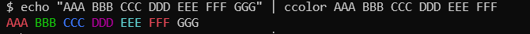
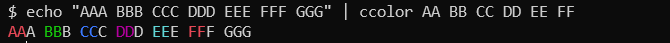
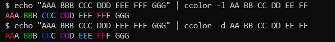
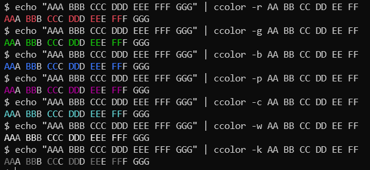
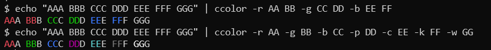

# ccolor commond

# Overview

Color highlighting in the Bash command line.
Bashコマンド用に特定の文字に色を付けるハイライト機能。


## Simple Sample

```
$ echo "AAA BBB CCC DDD EEE FFF GGG" | ccolor AAA
```


```
$ echo "AAA BBB CCC DDD EEE FFF GGG" | ccolor AAA BBB CCC DDD EEE FFF
```



```
$ echo "AAA BBB CCC DDD EEE FFF GGG" | ccolor AA BB CC DD EE FF
```



## Color Sample

### Light(default)/Dark Color
```
$ echo "AAA BBB CCC DDD EEE FFF GGG" | ccolor -l AA BB CC DD EE FF
$ echo "AAA BBB CCC DDD EEE FFF GGG" | ccolor -d AA BB CC DD EE FF
```



### Colors 色指定
```
$ echo "AAA BBB CCC DDD EEE FFF GGG" | ccolor -r AA BB CC DD EE FF
$ echo "AAA BBB CCC DDD EEE FFF GGG" | ccolor -g AA BB CC DD EE FF
$ echo "AAA BBB CCC DDD EEE FFF GGG" | ccolor -b AA BB CC DD EE FF
$ echo "AAA BBB CCC DDD EEE FFF GGG" | ccolor -p AA BB CC DD EE FF
$ echo "AAA BBB CCC DDD EEE FFF GGG" | ccolor -c AA BB CC DD EE FF
$ echo "AAA BBB CCC DDD EEE FFF GGG" | ccolor -w AA BB CC DD EE FF
$ echo "AAA BBB CCC DDD EEE FFF GGG" | ccolor -k AA BB CC DD EE FF
```



```
$ echo "AAA BBB CCC DDD EEE FFF GGG" | ccolor -r AA BB -g CC DD -b EE FF
$ echo "AAA BBB CCC DDD EEE FFF GGG" | ccolor -r AA -g BB -b CC -p DD -c EE -k FF -w GG
```



### Regex 正規表現
```
$ echo "AAA BBB CCC DDD EEE FFF GGG" | ccolor -r /A+/ -g /B+/ -b /C[C]/ -p /DDD?/ -c /EE*/
```


# Installation インストール

## RPM Install
```
yum install https://github.com/tryandhappy/ccolor/releases/latest/download/ccolor.noarch.rpm
```
```
dnf install https://github.com/tryandhappy/ccolor/releases/latest/download/ccolor.noarch.rpm
```


## Debian/Ubuntu Install
```
wget https://github.com/tryandhappy/ccolor/releases/latest/download/ccolor_all.deb
apt install ./ccolor_0.1.2-1_all.deb
```


## General Linux
```
wget -O /usr/bin/ccolor https://github.com/tryandhappy/ccolor/releases/latest/download/ccolor
```


# Usage 使い方


引数省略したときは、ログを見るときに便利な、主要な注意すべき文字をハイライトします。

```
cat /var/log/messages | ccolor
tail -f /var/log/syslog | ccolor
```


## Default value when the argument in not specified

This is a command in Bash that simply colors specific words.

引数を省略した場合は、下記ｎのオプションと同じになります。
この内容は随時変更していきます。
```
ccolor \
  -r Fatal Critical Alert Alart Exception Crash Abort Failed Panic Corrupt Overflow Underflow Invalid \
  -m Caution Deprecated Timeout Denied Refused Unauthorized Forbidden Unavailable Disconnect Reset Unexpected Broken
```


# Options オプション 引数

|Option|Description|
|----|----|
|-i|Case insensitive.|
|-l|Font color Light, Backgroup color Dark. 文字色明るめ、背景暗め。色は微妙な変化しか無い。|
|-d|Font color Dark, Backgroup color Ligit. 文字色暗め、背景明るめ。色は微妙な変化しか無い。|

|Font|Background|Color|
|----|----|----|
|-k|-0|Black 黒|
|-r|-1|Red 赤|
|-g|-2|Green 緑|
|-y|-3|Yellow 黄|
|-p|-4|Purple 紫|
|-m|-5|Magenta マゼンタ|
|-c|-6|Cyan シアン|
|-w|-7|White 白|


# Introduction

This is a command that simply adds color to specific words in Bash. It provides color highlighting.

For example, when viewing large amounts of log files, it is easy to miss important text. This command makes specific words easier to notice by coloring them.

It is written in Bash and awk, and I believe it has a very high level of safety. No network communication occurs.

Although it is highly secure, do not allow third parties to freely input arguments. There is a possibility of some form of injection.
This command was created with Claude Code (Ops 4.6).

Bashで特定の単語に色を付けるだけのコマンドです。色ハイライト。

例えば、ログファイルを大量に見る際、重要な文字を見逃すことも多いので、
特定の文字に色をつけて、わかりやすくします。

bashとawkで作られており、安全性が極めて高いと思います。
通信は発生しないので安全です。

安全性は高いとはいえ、引数を第3者に自由に入力できるようにはしないでください。
何らかのインジェクションが発生する可能性があります。

このコマンドはClaude Code (Ops 4.6)で作成しました。


# Build ビルド

bashスクリプトなので、インストール用のパッケージを作るだけ。

## RPM Build

```
mkdir -p packaging/rpmbuild/SOURCES
cp bin/ccolor packaging/rpmbuild/SOURCES/

cd packaging
./rpmbuild.sh
```


## Debian/Ubuntu deb Build

### Build
```
sudo apt install build-essential debhelper

cd packaging
./debian.sh
```

### Local Install
```
cp ccolor_0.1.0-1_all.deb /tmp/
sudo apt install /tmp/ccolor_0.1.2-1_all.deb
```
```
sudo dpkg -i ccolor_0.1.2-1_all.deb
```


## Linux Snap Build

### Build
```
sudo snap install snapcraft --classic
cd packaging

```


# Test Command

```
PS1='$ '

echo AAABBBCCCDDDEEEFFFGGGHHHIIIJJJ | ccolor -k0 BBB -k1 CCC -k2 DDD -k3 EEE -k4 FFF -k5 GGG -k6 HHH -k7 III
echo AAABBBCCCDDDEEEFFFGGGHHHIIIJJJ | ccolor -r0 BBB -r1 CCC -r2 DDD -r3 EEE -r4 FFF -r5 GGG -r6 HHH -r7 III
echo AAABBBCCCDDDEEEFFFGGGHHHIIIJJJ | ccolor -g0 BBB -g1 CCC -g2 DDD -g3 EEE -r4 FFF -g5 GGG -g6 HHH -g7 III
echo AAABBBCCCDDDEEEFFFGGGHHHIIIJJJ | ccolor -y0 BBB -y1 CCC -y2 DDD -y3 EEE -y4 FFF -y5 GGG -y6 HHH -y7 III
echo AAABBBCCCDDDEEEFFFGGGHHHIIIJJJ | ccolor -b0 BBB -b1 CCC -b2 DDD -b3 EEE -b4 FFF -b5 GGG -b6 HHH -b7 III
echo AAABBBCCCDDDEEEFFFGGGHHHIIIJJJ | ccolor -m0 BBB -m1 CCC -m2 DDD -m3 EEE -m4 FFF -m5 GGG -m6 HHH -m7 III
echo AAABBBCCCDDDEEEFFFGGGHHHIIIJJJ | ccolor -c0 BBB -c1 CCC -c2 DDD -c3 EEE -c4 FFF -c5 GGG -c6 HHH -c7 III
echo AAABBBCCCDDDEEEFFFGGGHHHIIIJJJ | ccolor -w0 BBB -w1 CCC -w2 DDD -w3 EEE -w4 FFF -w5 GGG -w6 HHH -w7 III

echo ABC-k0-k1-k2-k4-k5-k6-k7ABC | ccolor -k0 'k0' -k1 '-k1' -k2 '-k2' -k3 EEE -k4 FFF -k5 GGG -k6 HHH -k7 III
echo AAABBBCCCDDDEEEFFFGGGHHHIIIJJJ | ccolor -r0 BBB -r1 CCC -r2 DDD -r3 EEE -r4 FFF -r5 GGG -r6 HHH -r7 III
echo AAABBBCCCDDDEEEFFFGGGHHHIIIJJJ | ccolor -g0 BBB -g1 CCC -g2 DDD -g3 EEE -r4 FFF -g5 GGG -g6 HHH -g7 III
echo AAABBBCCCDDDEEEFFFGGGHHHIIIJJJ | ccolor -y0 BBB -y1 CCC -y2 DDD -y3 EEE -y4 FFF -y5 GGG -y6 HHH -y7 III
echo AAABBBCCCDDDEEEFFFGGGHHHIIIJJJ | ccolor -b0 BBB -b1 CCC -b2 DDD -b3 EEE -b4 FFF -b5 GGG -b6 HHH -b7 III
echo AAABBBCCCDDDEEEFFFGGGHHHIIIJJJ | ccolor -m0 BBB -m1 CCC -m2 DDD -m3 EEE -m4 FFF -m5 GGG -m6 HHH -m7 III
echo AAABBBCCCDDDEEEFFFGGGHHHIIIJJJ | ccolor -c0 BBB -c1 CCC -c2 DDD -c3 EEE -c4 FFF -c5 GGG -c6 HHH -c7 III
echo AAABBBCCCDDDEEEFFFGGGHHHIIIJJJ | ccolor -w0 BBB -w1 CCC -w2 DDD -w3 EEE -w4 FFF -w5 GGG -w6 HHH -w7 III

echo ABC  k  r  g  y  b  m  c  w ABC | ccolor  -k  k  -r  r  -g  g  -y  y  -b  b  -m  m  -c  c  -w  w
echo ABC  0  1  2  3  4  5  6  7 ABC | ccolor  -0  0  -1  1  -2  2  -3  3  -4  4  -5  5  -6  6  -7  7
echo ABC k0 k1 k2 k3 k4 k5 k6 k7 ABC | ccolor -k0 k0 -k1 k1 -k2 k2 -k3 k3 -k4 k4 -k5 k5 -k6 k6 -k7 k7
echo ABC r0 r1 r2 r3 r4 r5 r6 r7 ABC | ccolor -r0 r0 -r1 r1 -r2 r2 -r3 r3 -r4 r4 -r5 r5 -r6 r6 -r7 r7
echo ABC g0 g1 g2 g3 g4 g5 g6 g7 ABC | ccolor -g0 g0 -g1 g1 -g2 g2 -g3 g3 -g4 g4 -g5 g5 -g6 g6 -g7 g7
echo ABC y0 y1 y2 y3 y4 y5 y6 y7 ABC | ccolor -y0 y0 -y1 y1 -y2 y2 -y3 y3 -y4 y4 -y5 y5 -y6 y6 -y7 y7
echo ABC b0 b1 b2 b3 b4 b5 b6 b7 ABC | ccolor -b0 b0 -b1 b1 -b2 b2 -b3 b3 -b4 b4 -b5 b5 -b6 b6 -b7 b7
echo ABC m0 m1 m2 m3 m4 m5 m6 m7 ABC | ccolor -m0 m0 -m1 m1 -m2 m2 -m3 m3 -m4 m4 -m5 m5 -m6 m6 -m7 m7
echo ABC c0 c1 c2 c3 c4 c5 c6 c7 ABC | ccolor -c0 c0 -c1 c1 -c2 c2 -c3 c3 -c4 c4 -c5 c5 -c6 c6 -c7 c7
echo ABC w0 w1 w2 w3 w4 w5 w6 w7 ABC | ccolor -w0 w0 -w1 w1 -w2 w2 -w3 w3 -w4 w4 -w5 w5 -w6 w6 -w7 w7

echo ABC k0 k1 k2 k3 k4 k5 k6 k7 ABC | ccolor -d -k0 k0 -k1 k1 -k2 k2 -k3 k3 -k4 k4 -k5 k5 -k6 k6 -k7 k7
echo ABC r0 r1 r2 r3 r4 r5 r6 r7 ABC | ccolor -d -r0 r0 -r1 r1 -r2 r2 -r3 r3 -r4 r4 -r5 r5 -r6 r6 -r7 r7
echo ABC g0 g1 g2 g3 g4 g5 g6 g7 ABC | ccolor -d -g0 g0 -g1 g1 -g2 g2 -g3 g3 -g4 g4 -g5 g5 -g6 g6 -g7 g7
echo ABC y0 y1 y2 y3 y4 y5 y6 y7 ABC | ccolor -d -y0 y0 -y1 y1 -y2 y2 -y3 y3 -y4 y4 -y5 y5 -y6 y6 -y7 y7
echo ABC b0 b1 b2 b3 b4 b5 b6 b7 ABC | ccolor -d -b0 b0 -b1 b1 -b2 b2 -b3 b3 -b4 b4 -b5 b5 -b6 b6 -b7 b7
echo ABC m0 m1 m2 m3 m4 m5 m6 m7 ABC | ccolor -d -m0 m0 -m1 m1 -m2 m2 -m3 m3 -m4 m4 -m5 m5 -m6 m6 -m7 m7
echo ABC c0 c1 c2 c3 c4 c5 c6 c7 ABC | ccolor -d -c0 c0 -c1 c1 -c2 c2 -c3 c3 -c4 c4 -c5 c5 -c6 c6 -c7 c7
echo ABC w0 w1 w2 w3 w4 w5 w6 w7 ABC | ccolor -d -w0 w0 -w1 w1 -w2 w2 -w3 w3 -w4 w4 -w5 w5 -w6 w6 -w7 w7

echo AAABBBCCCDDDEEEFFFGGGHHHIIIJJJ | ccolor -l -r0 BBB -r1 CCC -r2 DDD -r3 EEE -r4 FFF -r5 GGG -r6 HHH -r7 III
echo AAABBBCCCDDDEEEFFFGGGHHHIIIJJJ | ccolor -d -r0 BBB -r1 CCC -r2 DDD -r3 EEE -r4 FFF -r5 GGG -r6 HHH -r7 III
```
